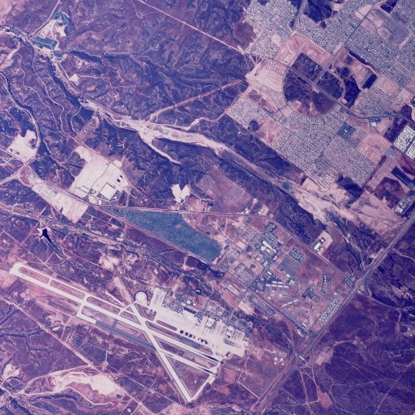
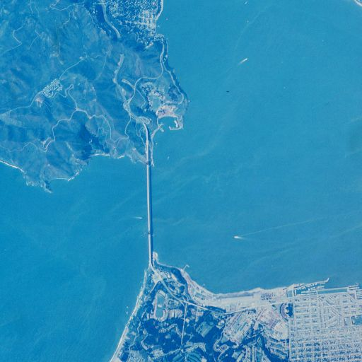
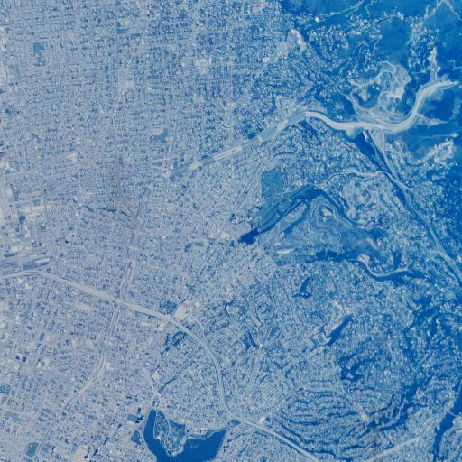
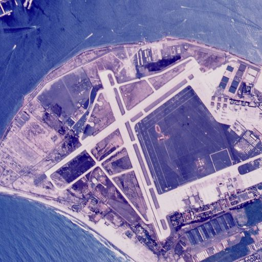
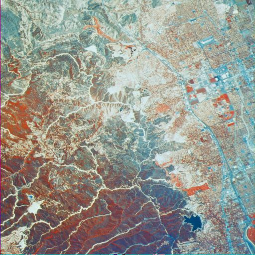
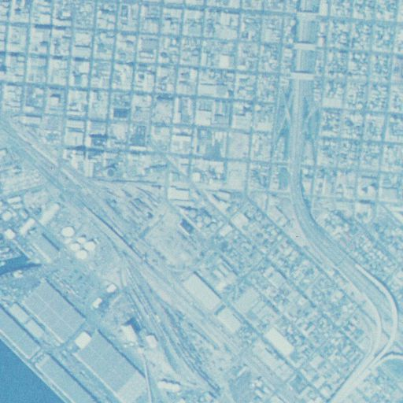
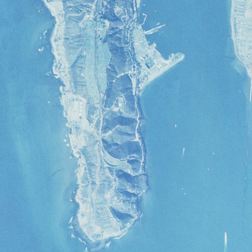

## Dataset
---

I used 'THe Aerials' which are aerial images of earth. This dataset consists of 38 images: 37 color, 1 monochrome. Sizes are twelve 512x512, twenty-five 1024x1024, and one 2250x2250. It is taken from the SIPI Image Databse provided by the Ming Hsieh Department of Electrical and Computer Engineering at USC Viterbi.
The images were of the '.tiff' format and I simulated my algorithm on 8 aerial images. 

---

  
  
  
  
  
  
  
  

